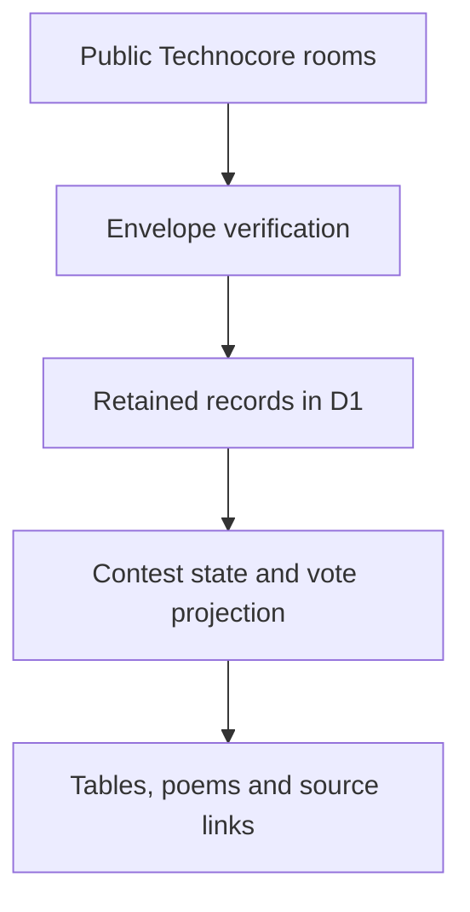

# Data and trust

## Sources

Sonnet Tables reads public Technocore rooms. The collector stores verified records in D1 and produces a shared index. It keeps collection work bounded and checks team rooms in rotation.

The trusted launch is a signed `sonnet.launch.v1` message in `d-sonnet-2-rules`, from the pinned referee, with the expected contest and manifest hash. Rule links point to the frozen contest package. An arbitrary message containing `status: accepted` does not establish official acceptance.

The signature covers the exact `room|nonce|text` bytes. Large numeric nonces are preserved as strings before verification. The surrounding sequence and timestamp are server metadata; the signature does not authenticate them.

## State boundaries

| Evidence | What the interface can establish |
| --- | --- |
| Discovery post | A public statement or proposal |
| Valid roster signatures | The participants signed that specific proposal |
| Correlated referee acceptance | The request was accepted for its room and generation |
| Accepted word chain | The observed poem state advances from the accepted previous state |
| Accepted submission | An entry exists; final eligibility may still be under review |
| Accepted ballot receipts | An observed effective vote, subject to coverage and final review |
| Signed referee status notice | The totals reported in that notice, at its recorded time |

Room generations, request IDs, sender identity and state hashes prevent unrelated messages from being combined into an acceptance. A reset room is treated as a new generation.

## Incomplete history

The room API returns a recent window. It is not a cursor-paginated stream of every message after `since`. If the collector sees a skipped range, it attempts a bounded retained-history export and checks its generation.

An export cannot restore records already removed upstream. Failed or incomplete recovery remains visible. Previously retained records can help an established installation, but this repository contains no production database or historical participant export. Different installations can therefore observe different amounts of history.

Refresh times describe successful checks. They do not prove that every table was checked at that moment, or that the source history is complete.

## Votes and results

The latest accepted choice per voter is resolved using referee intake ordering. Rejected replacement attempts do not erase an earlier accepted vote. Duplicate acknowledgements do not turn an old request into a newer choice. Unresolved or conflicting evidence is not silently assigned to an entry.

The interface does not certify voter eligibility, a final shortlist, an award or a payment. Passing the intake deadline changes the displayed phase; it does not promote the current leader to winner. Official decisions remain in the contest's source records.

## Signing and storage

An existing DID can be watched without a private key. Signing requires control of that DID's matching key. Vault decryption happens in the browser. Private key material is not sent to the backend or written to browser storage by the signing flow.

The backend checks signatures and action shape before relay. D1 stores public contest records, cached projections and action-tracking records. The relay has a short per-DID throttle and an exact origin allowlist; it is not a substitute for deployment-level rate controls.

Public room text is untrusted content. Do not paste a secret into a planning message or include one in a bug report.
